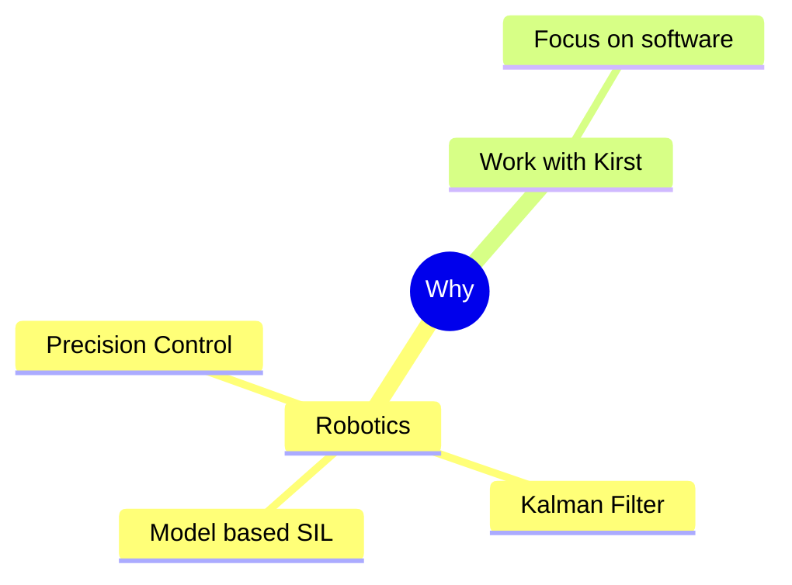
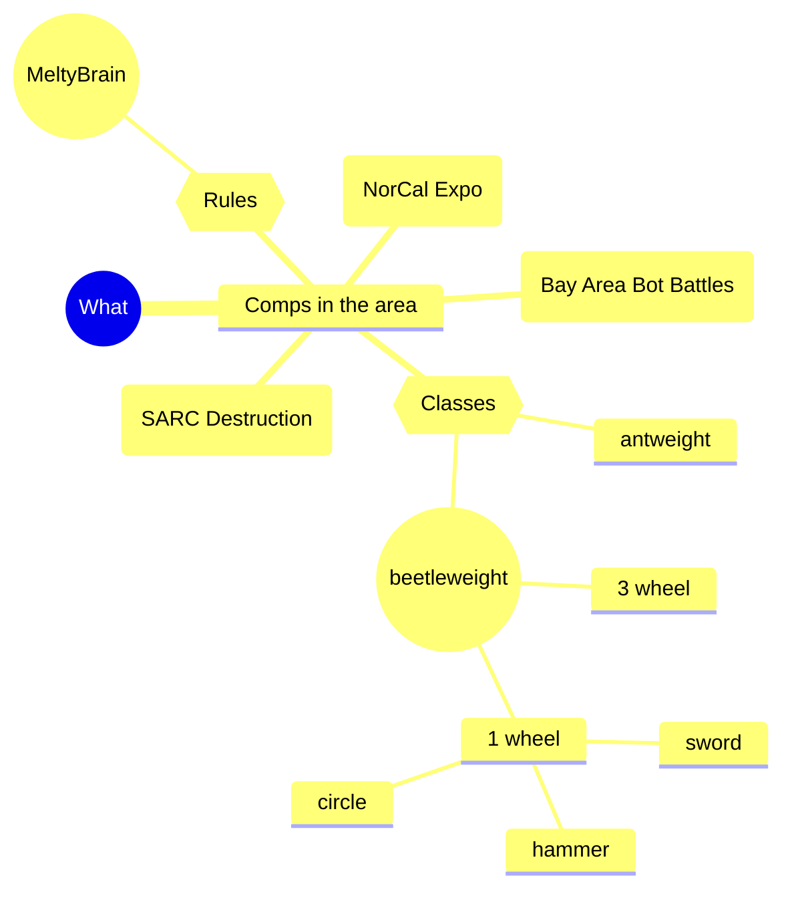
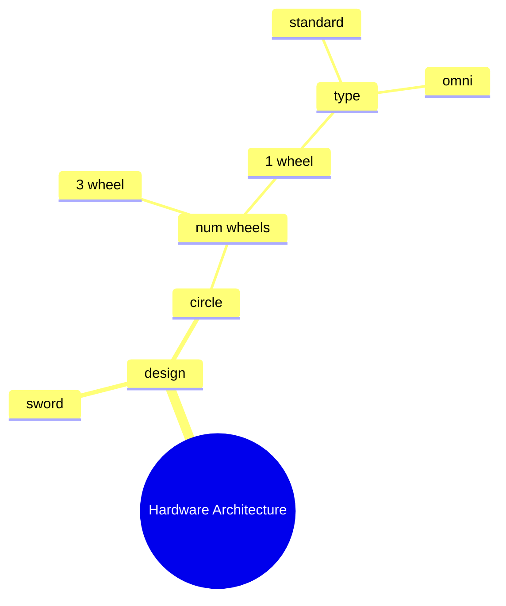

# mindmap

## The WHY

```mermaid
mindmap
  root((Why))
    Robotics
      Precision Control
      Kalman Filter
      Model based SIL
    Work with Kirst 
      Focus on software
```
## The What

```mermaid
mindmap
  root((What))
    Comps in the area
      (SARC Destruction)
      %%   11 ant, 8 beetle
      (Bay Area Bot Battles)
      %%   17 ant, 16 beetle
      (NorCal Expo)
      %%   8 ant, 11 beetle
      {{Rules}}
      %% uses SPARC
        ((MeltyBrain))
      %%   Only rule against is:
      %%   May be too destructive 
      {{Classes}}
          antweight
          ((beetleweight))
          %% I think 1 lb is a difficult target for a first attempt
            3 wheel
            1 wheel
              %% risky, but simple 
              sword
              hammer
              circle
```

```mermaid
mindmap
  root((Hardware Architecture))
    design
      sword 
      %% weaker than circle, if antweight then consider
    %%   hammer subset of sword
      circle 
        %% maximized moment of inertia
        %% Great mounting options
        %% strongest shape 
        %% a bit more expensive
        num wheels
            3 wheel
              %% heavy
            1 wheel
              %% risky, but simple 
              type 
                standard 
                omni
```