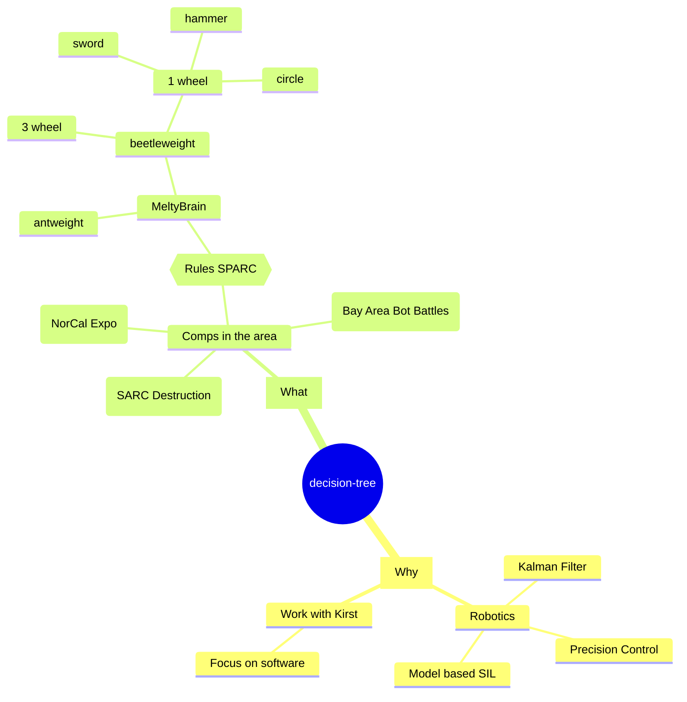

## mindmap

```mermaid
mindmap
  root((decision-tree))
    [Why]
      Robotics
        Precision Control
        Kalman Filter
        Model based SIL
      Work with Kirst 
        Focus on software
    [What]
      Comps in the area
        (SARC Destruction)
        %%   11 ant, 8 beetle
        (Bay Area Bot Battles)
        %%   17 ant, 16 beetle
        (NorCal Expo)
        %%   8 ant, 11 beetle
        {{Rules SPARC}}
          MeltyBrain
        %%   Only rule against is:
        %%   May be too destructive 
            antweight
            beetleweight
            %% I think 1 lb is a difficult target for a first attempt
              3 wheel
              1 wheel
                %% risky, but simple 
                sword
                hammer
                circle
```